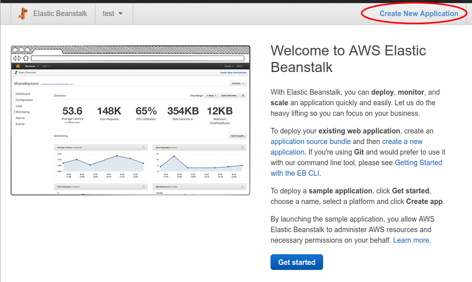
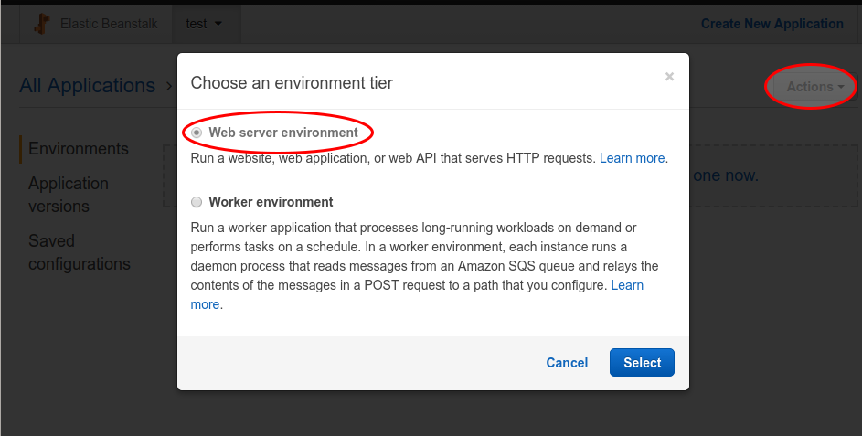
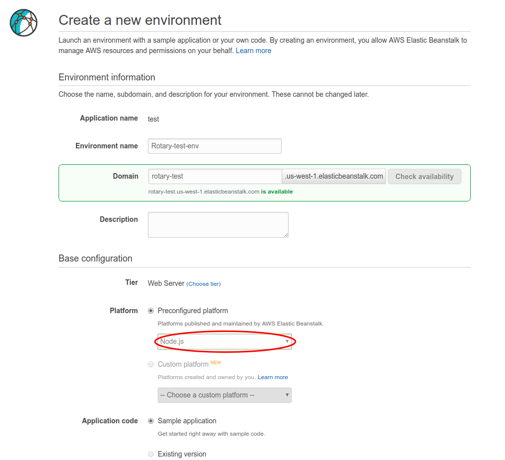
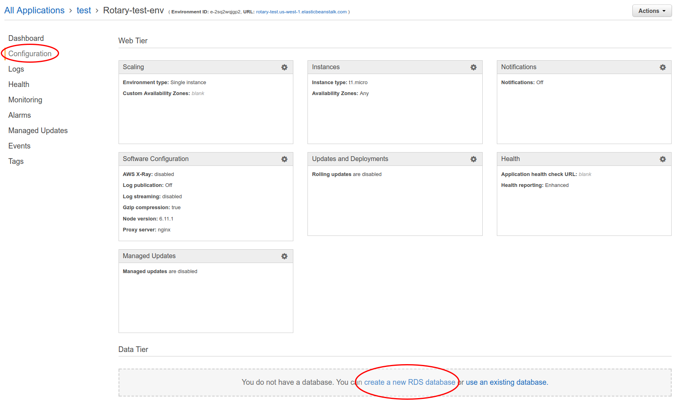
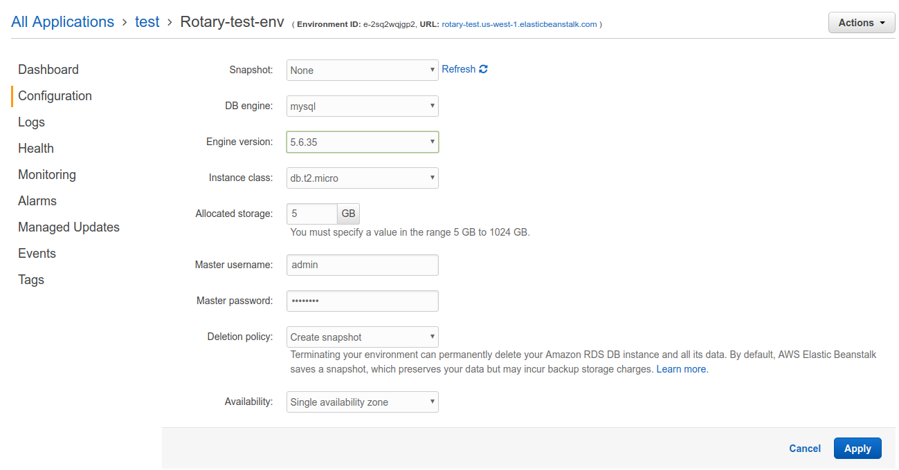
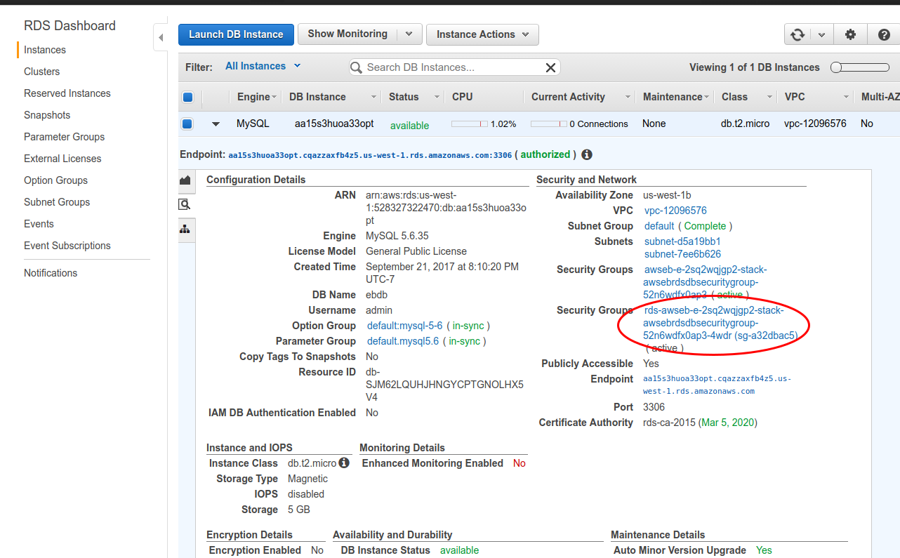
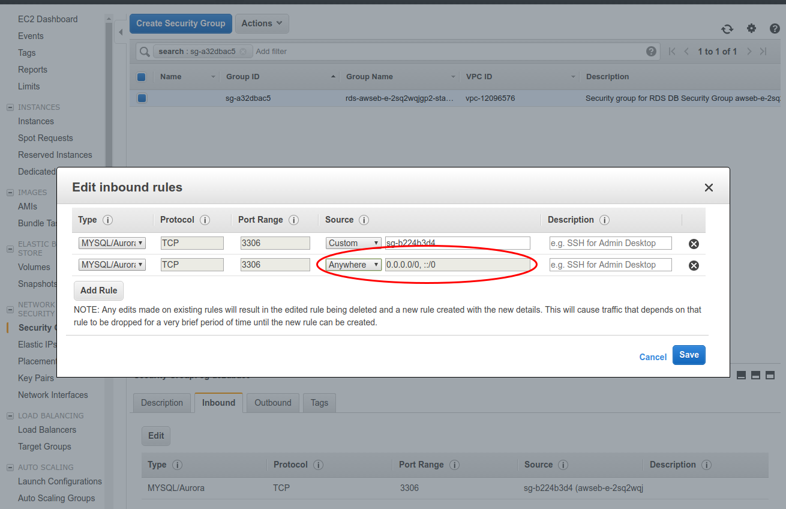
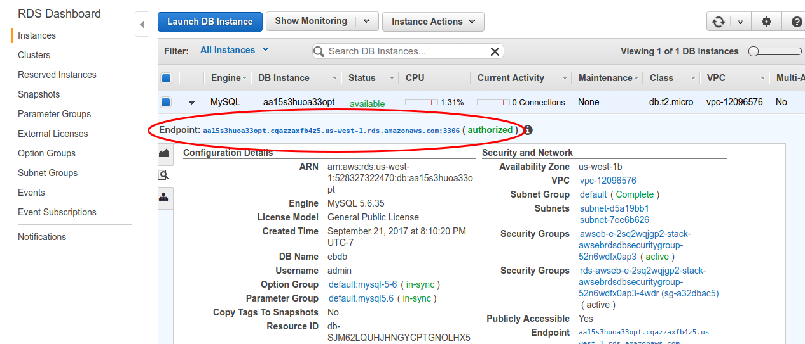
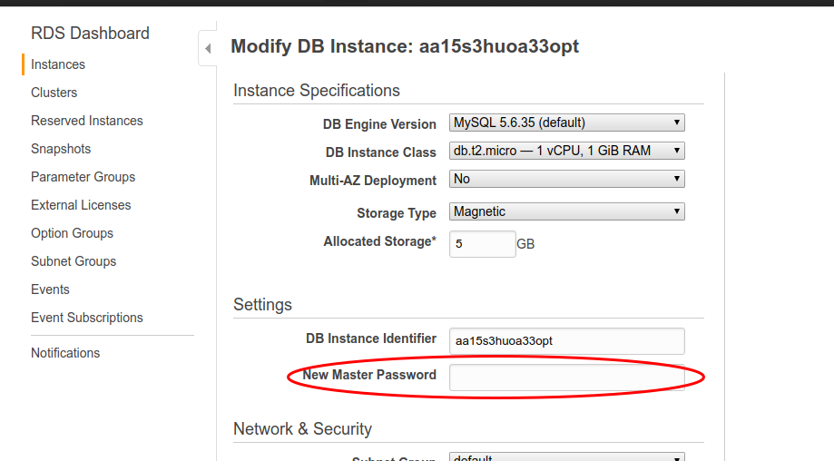

# Adding a Database to Elastic Beanstalk with RDS

This guide will show you how to create a database from AWS RDS and connect it to your AWS Elastic Beanstalk application. It will start with creating a Node application in Elastic Beanstalk.

## Table of Contents

- [Create a Node Application](#create-a-node-application)
- [Adding an RDS Database](#adding-an-rds-database)
- [Configuring Security](#configuring-security)
- [Connecting to the Database](#connecting-to-the-database)

## Create a Node Application

Log in to your AWS console, go to services, and select Elastic Beanstalk. Click on "Create New Application" in the top right.

Click on the "Actions" drop-down in the top right and select "Create environment". For our purposes we will choose "Web server environment."

Now configure the options for the web server. We are using Node.js for this project. For the tutorial we will use a sample application for the code, but for the project we would upload a zip file of our Express server files.

After configuration, it will take 5-10 minutes for AWS to create the server environment.

## Adding an RDS Database

While in the server environment, select "Configuration" in the top left. Go to the bottom section called "Data Tier" and click on "create a new RDS database."

Configure the database. This project will be using mysql. The micro level instance class is recommended since it is free tier. We should use the single availability zone option for the purposes of the project.

You should keep track of the master username and master password you set here, although later you can look up and change them, respectively.

After clicking apply, AWS will take another few minutes to create the RDS instance.

## Configuring Security

Currently, security for the RDS instance is configured so that only the Express server can access the database. We need to add additional permissions so we can edit the database with tools like MySQL Workbench and phpMyAdmin.

Select RDS in the services menu. Select the instance you just created and click on the middle tab with the magnifying glass. Click on the Security Group that begins with "rds-...".

Now go the the "Inbound" tab and click "Edit." There is already a rule that lets the Express server access the database. Add a new rule that has the same options, except for the "Source" option.

For the "Source" option we use "Anywhere" so any IP can connect to the database. This is so all team members have access during development. However, they will still need to know the username and password to be able to edit the database.

In production, it would be best to only allow the IP address of the client to connect to the database.

## Connecting to the Database

Now that the RDS database has been set up. You can connect to it through your preferred database management application. The "Endpoint" section in the instance information tab shows the hostname and port number needed to connect.

The username is shown in the same tab. If you forget the password, you can reset it by going to the "Instance Actions" drop-down and selecting "Modify". From there, you can change the password along with many other things. But please notify team members of any changes you make!

